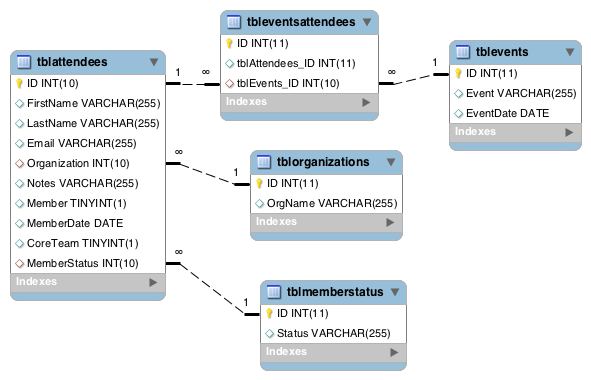

# membership
membership tracking database for Roosevelt @ Boston

This code uses elements of [Grocery CRUD](http://www.grocerycrud.com/) and [CodeIgniter](https://codeigniter.com/). 
For security and upgradeability, I located the CodeIgniter system files outside the project. The paths are specified 
in the ```public/index.php``` file. There are step-by-step installation instructions I followed from 
[a forum post](http://askubuntu.com/questions/25446/how-to-install-codeigniter). Database connection settings in
```application/config/database.php``` are environment variables that I pass through the nginx config file
(using fastcgi_params). 

